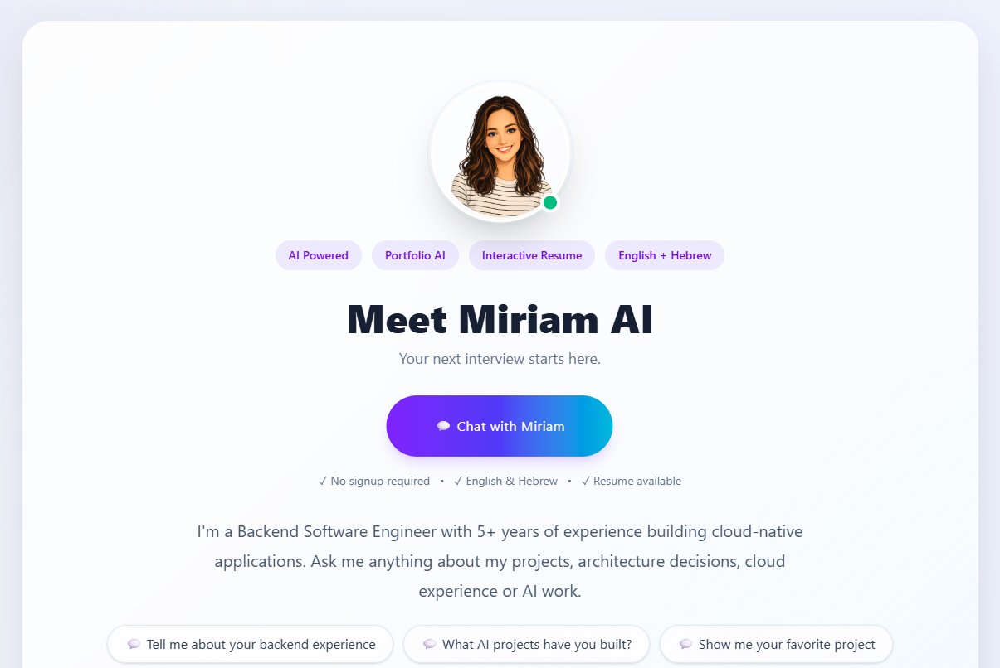
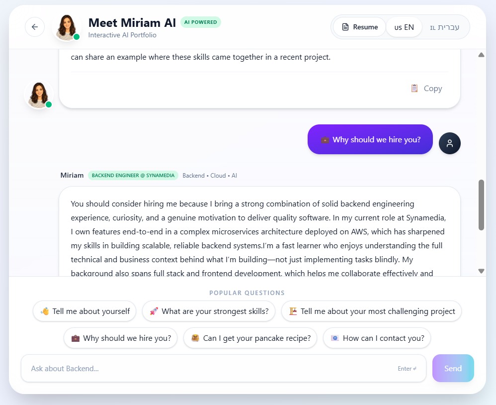

# Meet Miriam AI

> **An AI-powered interactive portfolio that allows recruiters to interview me through a natural conversation.**

<p align="center">

[]()
[]()
[]()
[]()

</p>

## 🌐 Live Demo

👉 https://meet-miriam-ai-blue.vercel.app

---

## Preview

### Landing Page



---

### AI Chat



---

## Overview

Meet Miriam AI is an interactive portfolio that lets recruiters explore my professional experience through conversation instead of reading a static resume.

The assistant answers questions about my engineering experience, projects, architecture decisions and technical background using a custom retrieval pipeline and dynamic prompt generation.

---

## Features

- 💬 AI-powered interview experience
- ⚡ Streaming responses
- 🌍 English & Hebrew support
- 📝 Markdown rendering with syntax highlighting
- 📋 Copy response button
- 📱 Responsive UI
- 🎯 Dynamic context selection
- 🧠 Advanced prompt engineering
- 🚀 FastAPI backend
- ⚛️ React + TypeScript frontend

---

## Architecture

```text
Browser
    │
React + TypeScript
    │
FastAPI API
    │
Context Router
    │
Markdown Knowledge Base
    │
Prompt Builder
    │
OpenAI API
    │
Streaming Response
```

---

## Tech Stack

| Layer | Technologies |
|-------|--------------|
| Frontend | React 19, TypeScript, Vite, Tailwind CSS, React Query |
| Backend | FastAPI, Python |
| AI | OpenAI API, Custom Retrieval Pipeline, Prompt Engineering |
| Deployment | Vercel, Render |

---

## Running Locally

### Frontend

```bash
npm install
npm run dev
```

### Backend

```bash
cd backend

python -m venv .venv

# Windows
.venv\Scripts\activate

# Linux / macOS
source .venv/bin/activate

pip install -r requirements.txt

uvicorn app.main:app --reload
```

---

## Environment Variables

Frontend

```env
VITE_API_URL=http://localhost:8000
```

Backend

```env
OPENAI_API_KEY=your_api_key
FRONTEND_URL=http://localhost:5173
```

---

## Future Improvements

- Conversation history
- Authentication
- Conversation persistence
- Semantic retrieval using embeddings
- Vector database integration
- Streaming optimizations
- Analytics dashboard

---

## License

This project is licensed under the MIT License.